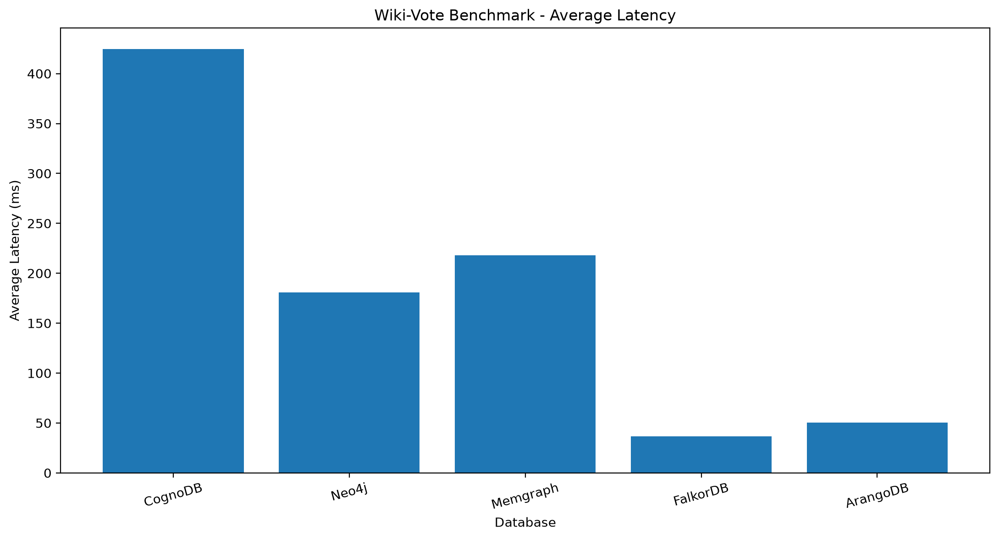
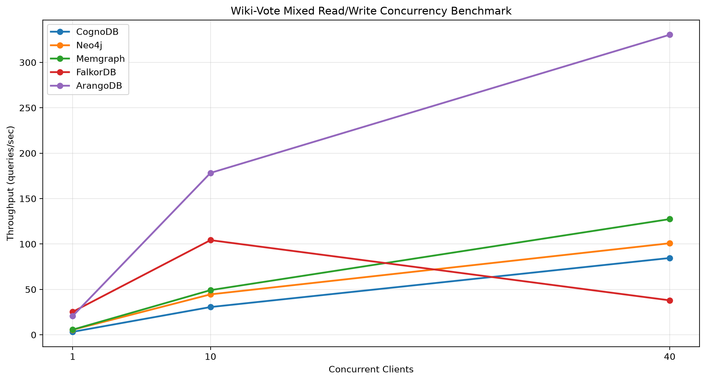

# CognoDB Cloud Graph Database Benchmark

> A reproducible benchmarking framework for evaluating graph database performance using controlled workloads, latency analysis, concurrency testing, throughput measurement, and visual reporting.

[](https://www.python.org/)
[](https://www.docker.com/)
[](https://github.com/iravi0009/cognodb-cloud-benchmark)

---

## Overview

This project provides a modular benchmarking framework for evaluating graph database performance under controlled and reproducible workloads.

The benchmark currently supports:

- CognoDB
- Neo4j
- Memgraph
- FalkorDB
- ArangoDB

The framework measures query latency, throughput, concurrency behavior, successful operations, errors, and statistical performance metrics.

The project uses the Wiki-Vote graph dataset as a real-world graph workload and includes both latency-based and mixed read/write concurrency benchmarks.

## Key Features

- Multi-database graph benchmarking
- Modular database adapters
- Wiki-Vote graph dataset
- Point and indexed lookups
- 1-hop, 2-hop, and 3-hop graph traversal
- Incoming and outgoing relationship counts
- High-degree graph analysis
- Global relationship counting
- Latency measurement
- P50 / P95 / P99 analysis
- Mixed 80/20 read/write workloads
- Concurrency testing at 1, 10, and 40 workers
- Throughput / QPS measurement
- CSV-based raw and processed results
- Automated benchmark charts
- Docker-based ArangoDB environment
- PowerShell-friendly workflow


## Supported Databases

| Database | Integration | Status |
|---|---|---|
| CognoDB | Custom Adapter | ✅ |
| Neo4j | Python Driver | ✅ |
| Memgraph | Python Driver | ✅ |
| FalkorDB | Redis/FalkorDB Client | ✅ |
| ArangoDB | python-arango | ✅ |


## Wiki-Vote Dataset

The primary graph benchmark uses the Wiki-Vote dataset.

### Dataset Size

| Metric | Value |
|---|---:|
| WikiUser nodes | 7,115 |
| VOTES relationships | 103,689 |

The graph represents directed voting relationships between Wikipedia users.

### Graph Model

```text
WikiUser ───── VOTES ─────> WikiUser


---


Add:

```markdown
## Benchmark Workloads

The Wiki-Vote benchmark contains nine workloads:

| Workload | Description |
|---|---|
| `wikivote_point_lookup` | Point lookup by user ID |
| `wikivote_indexed_lookup` | Indexed lookup by user ID |
| `wikivote_one_hop` | One-hop outgoing traversal |
| `wikivote_two_hop` | Two-hop traversal |
| `wikivote_three_hop` | Three-hop traversal |
| `wikivote_outgoing_count` | Count outgoing votes |
| `wikivote_incoming_count` | Count incoming votes |
| `wikivote_high_degree` | Find high-degree users |
| `wikivote_global_count` | Count all vote relationships |


## Latency Benchmark

The benchmark records:

- Average latency
- Median / P50
- Minimum latency
- Maximum latency
- P95 latency
- P99 latency

### Wiki-Vote Results

| Database | Measurements | Average | P50 | Minimum | Maximum | P95 |
|---|---:|---:|---:|---:|---:|---:|
| CognoDB | 270 | 424.429 ms | 267.629 ms | 257.204 ms | 1614.861 ms | 1500.923 ms |
| Neo4j | 270 | 180.937 ms | 177.529 ms | 171.549 ms | 255.048 ms | 201.476 ms |
| Memgraph | 90 | 218.002 ms | 181.060 ms | 175.380 ms | 809.973 ms | 417.799 ms |
| FalkorDB | 45 | 36.781 ms | 35.968 ms | 32.918 ms | 44.882 ms | 43.094 ms |
| ArangoDB | 900 | 50.617 ms | 49.150 ms | 35.918 ms | 111.367 ms | 56.150 ms |


### Average Latency Visualization




## Mixed Read/Write Concurrency Benchmark

A standardized mixed workload was implemented across all five databases.

### Configuration

| Parameter | Value |
|---|---|
| Read operations | 80% |
| Write operations | 20% |
| Operations per level | 400 |
| Concurrency levels | 1, 10, 40 |
| Databases | 5 |


### Throughput Results

| Database | 1 Worker | 10 Workers | 40 Workers |
|---|---:|---:|---:|
| CognoDB | 3.29 QPS | 30.58 QPS | 84.58 QPS |
| Neo4j | 5.52 QPS | 44.54 QPS | 100.83 QPS |
| Memgraph | 5.70 QPS | 49.20 QPS | 127.43 QPS |
| FalkorDB | 25.34 QPS | 104.26 QPS | 37.97 QPS |
| ArangoDB | 20.78 QPS | 178.28 QPS | 330.43 QPS |


### Concurrency Visualization




### Observed Result

Under the tested 80/20 mixed read/write workload, ArangoDB achieved the highest recorded throughput at concurrency 40 with 330.43 QPS.

These results are specific to this benchmark configuration, dataset, database configuration, and execution environment and should not be interpreted as a universal database ranking.

## Benchmark Architecture

```text
Dataset
   │
   ▼
Dataset Validation
   │
   ▼
Database Loader
   │
   ▼
Database Adapter
   │
   ▼
Benchmark Runner
   │
   ▼
Raw Measurements
   │
   ├───────────────┐
   ▼               ▼
Statistics       Charts
   │               │
   └───────┬───────┘
           ▼
      Final Results


---
Use:

```markdown
## Project Structure

```text
cognodb-cloud-benchmark/
│
├── data/
├── results/
│   ├── raw/
│   ├── processed/
│   └── charts/
│
├── scripts/
│   ├── generate_dataset.py
│   ├── validate_dataset.py
│   ├── load_cognodb.py
│   ├── load_neo4j.py
│   ├── load_wikivote_cognodb.py
│   ├── load_wikivote_neo4j.py
│   ├── load_wikivote_memgraph.py
│   ├── load_wikivote_arangodb.py
│   ├── compare_wikivote_all.py
│   ├── mixed_wikivote_benchmark.py
│   ├── plot_wikivote_all.py
│   └── plot_wikivote_concurrency.py
│
├── src/
│   └── benchmark/
│       ├── adapters/
│       ├── workloads/
│       └── runner.py
│
├── .env.example
├── requirements.txt
└── README.md


---

```markdown
## Installation

### 1. Clone the repository

```powershell
git clone https://github.com/iravi0009/cognodb-cloud-benchmark.git
cd cognodb-cloud-benchmark


---

'''
2. Create virtual environment
python -m venv .venv
3. Activate environment
.venv\Scripts\Activate.ps1
4. Install dependencies
pip install -r requirements.txt
'''

# -Add benchmark commands

```markdown
## Running the Benchmark

### Run Wiki-Vote benchmark

```powershell
python -m src.benchmark.runner --database arangodb --dataset wikivote --warmup 3 --runs 30

'''
Compare databases
python scripts\compare_wikivote_all.py
Generate latency chart
python scripts\plot_wikivote_all.py
Run concurrency benchmark
python -m scripts.mixed_wikivote_benchmark --database arangodb --operations 400
Generate concurrency chart
python scripts\plot_wikivote_concurrency.py
'''


---

# — Add results location

```markdown
## Results

### Raw Results

```text
results/raw/

---
Processed Results
results/processed/

Important files include:

cognodb_vs_neo4j_memgraph_falkordb_arangodb_wikivote.csv
wikivote_mixed_concurrency.csv
Visualizations
results/charts/

Generated charts:

wikivote_all_database_latency.png
wikivote_mixed_concurrency.png
---


---

# — Add limitations

This section is **very important professionally**.

```markdown
## Fairness and Limitations

Benchmark results depend on the execution environment and configuration.

Important factors include:

- Hardware resources
- Database configuration
- Network latency
- Cloud region
- Connection overhead
- Dataset size
- Query implementation
- Number of measurements
- Concurrency configuration

The current latency comparison contains different measurement counts across databases. Therefore, the results should be interpreted as recorded benchmark observations rather than a statistically identical experiment.

Future experiments will use equal measurement counts and additional statistical analysis.


## Future Improvements

- Equal-sample benchmark runs
- Standard deviation
- Confidence intervals
- Longer sustained workloads
- Connection-pool analysis
- Automated benchmark regression testing
- CI/CD integration
- Additional graph datasets
- Additional traversal patterns
- Automated HTML reports
- Historical performance tracking


